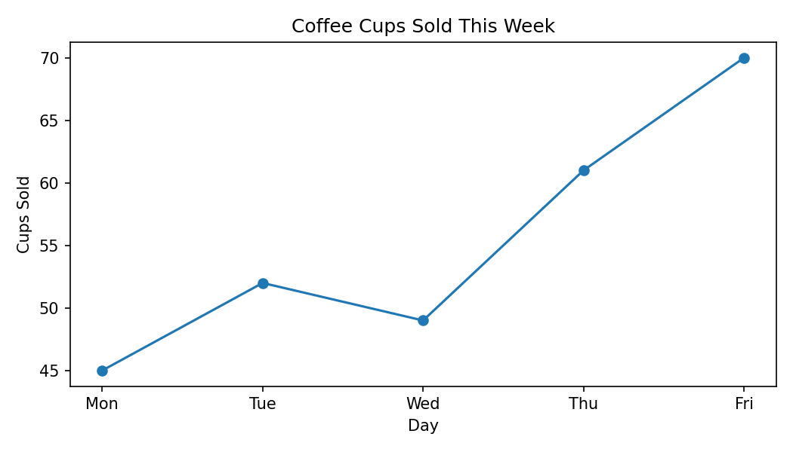
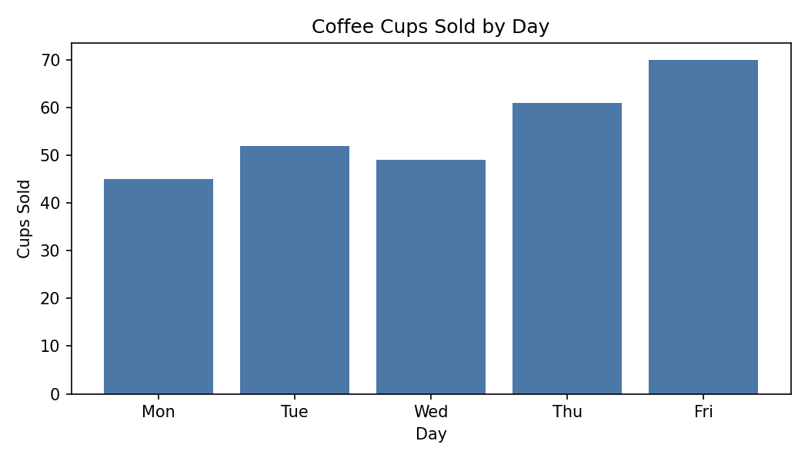
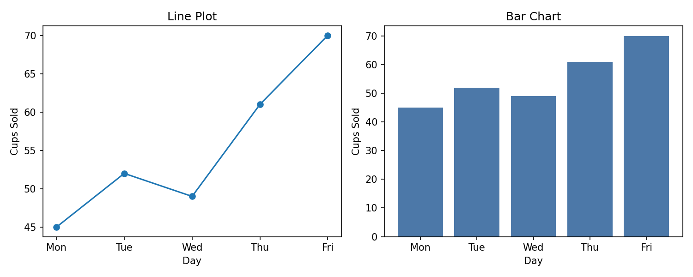
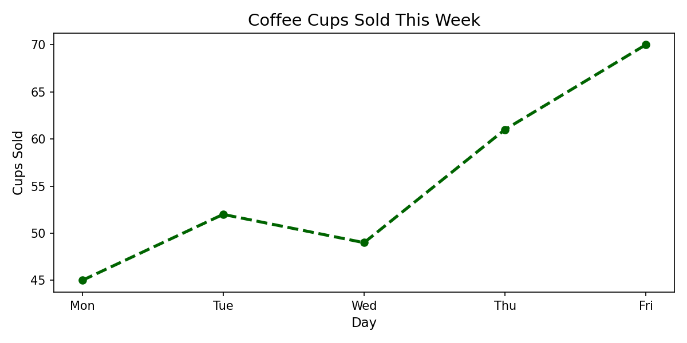
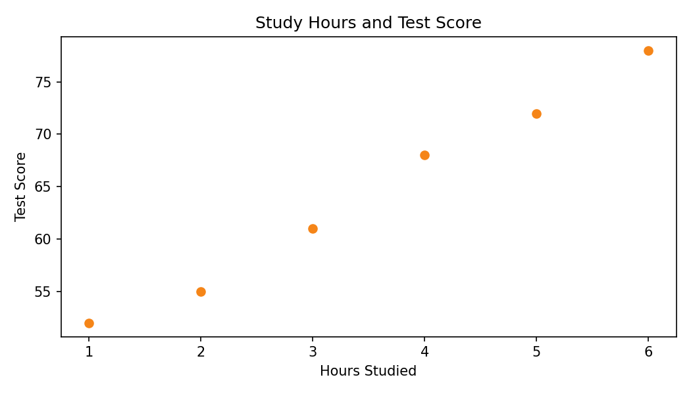

# 02. Worked Examples: Matplotlib Basics

## Example A: Create the CSV, Then Load and Inspect It

Create this structure:

```text
week5-matplotlib-demo/
  data/
    coffee_sales.csv
  scripts/
    plot_coffee_sales.py
```

Create `data/coffee_sales.csv` with this content:

```text
day,cups_sold
Mon,45
Tue,52
Wed,49
Thu,61
Fri,70
```

Then create `scripts/plot_coffee_sales.py`:

```python
from pathlib import Path

import pandas as pd
import matplotlib.pyplot as plt

BASE_DIR = Path(__file__).resolve().parent.parent
DATA_DIR = BASE_DIR / "data"

df = pd.read_csv(DATA_DIR / "coffee_sales.csv")

print(df.head())
print(df.columns)
print(df.dtypes)
```

This first step matters because plotting works better when you already know the column names and value types.

We use `pathlib` here because the script is inside `scripts/`, while the CSV is inside `data/`.

## Example B: Make a Simple Line Plot

Before writing the plot line, give the x-axis values and y-axis values names. This makes the code easier to read.

In `ax.plot(x_values, y_values)`, the first value is for the x-axis and the second value is for the y-axis.

Add this code below the data-loading code:

```python
x_values = df["day"]
y_values = df["cups_sold"]

fig, ax = plt.subplots()

ax.plot(x_values, y_values)
ax.set_title("Coffee Cups Sold This Week")
ax.set_xlabel("Day")
ax.set_ylabel("Cups Sold")

plt.show()
plt.close(fig)
```

- `x_values` stores the values we want on the x-axis.
- `y_values` stores the values we want on the y-axis.
- `fig, ax = plt.subplots()` creates one figure and one chart area.
- `ax.plot(x_values, y_values)` creates the line plot.
- `plt.show()` displays the chart.
- `plt.close(fig)` is a good habit when you are finished with that figure.

This plot is useful because the days have a natural order.

Reference output:



Your plot does not need to look pixel-perfect, but the chart type, labels, and overall pattern should match.

## Example C: Make a Bar Chart with the Same Data

```python
x_values = df["day"]
y_values = df["cups_sold"]

fig, ax = plt.subplots()

ax.bar(x_values, y_values)
ax.set_title("Coffee Cups Sold by Day")
ax.set_xlabel("Day")
ax.set_ylabel("Cups Sold")

plt.show()
plt.close(fig)
```

The bar chart uses the same data, but it helps you read each day as its own separate amount.

That means:

- a line chart is helpful when you want to notice how the values move across the week,
- a bar chart is helpful when you want to compare the size of Monday, Tuesday, Wednesday, and so on more directly.

Reference output:



Friday is still the highest day, but the bars make it easier to compare each day one by one.

## Example D: Reuse the Same Data with Two Subplots

You can also place both chart types in one figure.

```python
x_values = df["day"]
y_values = df["cups_sold"]

fig, axes = plt.subplots(1, 2, figsize=(10, 4))

axes[0].plot(x_values, y_values)
axes[0].set_title("Line Plot")
axes[0].set_xlabel("Day")
axes[0].set_ylabel("Cups Sold")

axes[1].bar(x_values, y_values)
axes[1].set_title("Bar Chart")
axes[1].set_xlabel("Day")
axes[1].set_ylabel("Cups Sold")

plt.tight_layout()
plt.show()
plt.close(fig)
```

- `axes[0]` means the first chart.
- `axes[1]` means the second chart.
- `figsize=(10, 4)` makes the figure wider so both charts fit comfortably.

Reference output:



This is useful when you want students to compare how the same data looks in two chart types.

## Example E: Add Simple Customization

You do not need to customize every chart, but it is useful to know that Matplotlib gives you clear control over style.

```python
x_values = df["day"]
y_values = df["cups_sold"]

fig, ax = plt.subplots(figsize=(8, 4))

ax.plot(
    x_values,
    y_values,
    color="darkgreen",
    linestyle="--",
    linewidth=2.5,
)
ax.set_title("Coffee Cups Sold This Week", fontsize=14)
ax.set_xlabel("Day", fontsize=11)
ax.set_ylabel("Cups Sold", fontsize=11)

plt.show()
fig.clf()
plt.close(fig)
```

- `figsize=(8, 4)` changes the figure size.
- `color`, `linestyle`, and `linewidth` change the look of the line.
- `fontsize` changes text size.
- `fig.clf()` clears the figure content.
- `plt.close(fig)` closes the figure when you are done.

Reference output:



For most scripts, `plt.close(fig)` matters more than `fig.clf()`. It is still useful to know both.

## Example F: Create a Scatter Plot with Two Numeric Columns

Create `data/study_hours.csv` with this content:

```text
hours_studied,test_score
1,52
2,55
3,61
4,68
5,72
6,78
```

Then use this script:

```python
from pathlib import Path

import pandas as pd
import matplotlib.pyplot as plt

BASE_DIR = Path(__file__).resolve().parent.parent
DATA_DIR = BASE_DIR / "data"

df = pd.read_csv(DATA_DIR / "study_hours.csv")

x_values = df["hours_studied"]
y_values = df["test_score"]

fig, ax = plt.subplots()

ax.scatter(x_values, y_values)
ax.set_title("Study Hours and Test Score")
ax.set_xlabel("Hours Studied")
ax.set_ylabel("Test Score")

plt.show()
plt.close(fig)
```

Scatter plots are useful when both columns are numeric. Here, the points move upward, which suggests that higher study
hours may be connected to higher scores.

Reference output:



This image is useful as a quick check. You should see points rising from left to right.

## Example G: Read the Plot in Simple English

After plotting, practice one short interpretation:

- The coffee sales plot shows that sales were highest on Friday.
- The study-hours scatter plot suggests that more study time is linked to higher test scores.

Keep interpretation simple. You are describing what the chart shows, not proving a deep statistical claim.

## Navigation

- ⬅️ Previous: [01-theory.md](./01-theory.md).
- 🧭 Week Overview: [week-05-overview.md](../week-05-overview.md).
- ➡️ Next: [03-practice.md](./03-practice.md).
