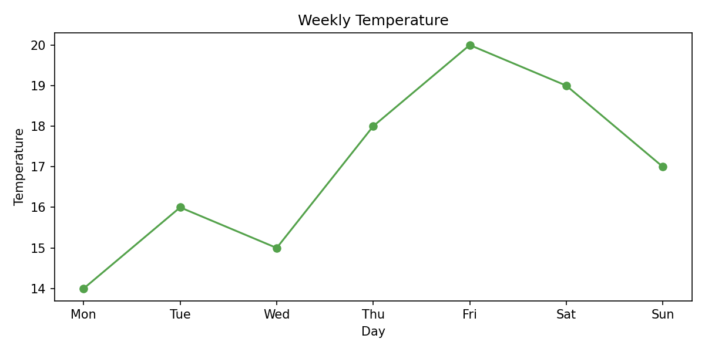
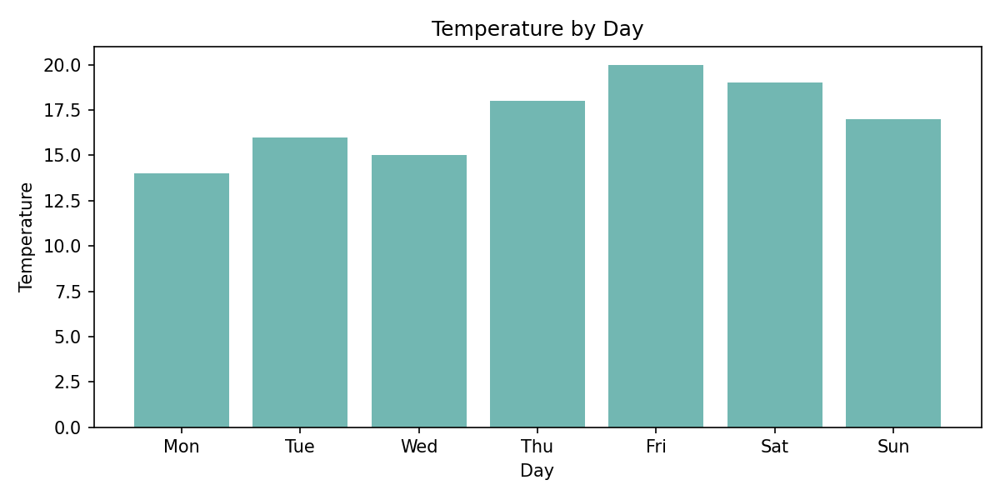

# 03. Practice: Matplotlib Basics

## Setup

1. Create a folder called `week5-matplotlib-practice`.
2. Inside that folder, create these folders:
   ```text
   data/
   scripts/
   ```
3. Inside `data/`, create a file called `weather_readings.csv`.
4. Put this exact content in `data/weather_readings.csv`:
    ```text
    day,temperature
    Mon,14
    Tue,16
    Wed,15
    Thu,18
    Fri,20
    Sat,19
    Sun,17
    ```
5. Inside `scripts/`, create a script called `plot_weather.py`.
6. Add this starter code:
   ```python
   from pathlib import Path

   import pandas as pd
   import matplotlib.pyplot as plt
   
   BASE_DIR = Path(__file__).resolve().parent.parent
   DATA_DIR = BASE_DIR / "data"
   
   df = pd.read_csv(DATA_DIR / "weather_readings.csv")
   
   print(df.head())
   print(df.columns)
   print(df.dtypes)
   ```

`pathlib` helps your script find the CSV in `data/` even though the script lives in `scripts/`.

## Tasks

1. Run the starter code and confirm that the file loads correctly.
2. Store `df["day"]` in `x_values` and `df["temperature"]` in `y_values`.
3. Create `fig, ax = plt.subplots()`.
4. Add a line plot that uses `day` on the x-axis and `temperature` on the y-axis.
5. Add the title `Weekly Temperature`.
6. Add x-axis label `Day`.
7. Add y-axis label `Temperature`.
8. Show the plot.
9. Close the figure.
10. In the same script, create a second chart as a bar chart using the same columns.
11. Change the second chart title to `Temperature by Day`.
12. Print one sentence after the plots, such as `Highest temperature is on Friday.` by checking the data yourself.

## Expected Output Examples

Possible printed output:

```text
Index(['day', 'temperature'], dtype='object')
day            object
temperature     int64
dtype: object
```

Your line plot and bar chart should both show:

- The lowest value on Monday.
- The highest value on Friday.

Possible final printed sentence:

```text
Highest temperature is on Friday.
```

Reference line plot:



Reference bar chart:



Your charts do not need to look exactly the same. Use them as a visual check for the chart type, labels, and the main
pattern in the data.

## Debug Task 1

Code:

```python
df = pd.read_csv(DATA_DIR / "weather.csv")
```

Expected behavior:

```text
You expected the CSV to load.
```

Actual behavior:

```text
It raises FileNotFoundError because the real file name is weather_readings.csv.
```

## Debug Task 2

Code:

```python
fig, ax = plt.subplots()
ax.plot(df["day"], df["temp"])
plt.show()
```

Expected behavior:

```text
You expected a line plot of the temperature column.
```

Actual behavior:

```text
It raises a KeyError because the real column name is "temperature".
```

## Debug Task 3

Code:

```python
fig, ax = plt.subplots()
ax.set_title("Weekly Temperature")
ax.set_xlabel("Day")
ax.set_ylabel("Temperature")
plt.show()
ax.plot(df["day"], df["temperature"])
```

Expected behavior:

```text
You expected the plotted data to appear with the labels.
```

Actual behavior:

```text
The chart may appear empty because show() happened before the plotting command.
```

## Self-Review

- I can load a CSV before plotting.
- I can name x-axis values and y-axis values clearly before plotting.
- I can choose a line plot or bar chart for a simple task.
- I can add a clear title and axis labels.
- I can debug path mistakes, wrong column names, and plot-order mistakes.

## Navigation

- ⬅️ Previous: [02-worked-examples.md](./02-worked-examples.md).
- 🧭 Week Overview: [week-05-overview.md](../week-05-overview.md).
- ➡️ Next: [04-challenge.md](./04-challenge.md).
