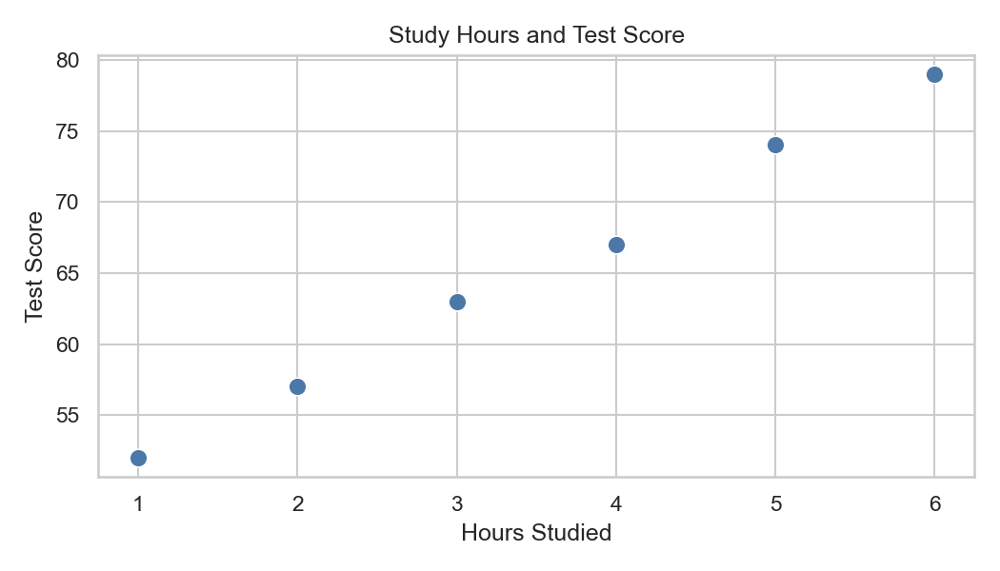
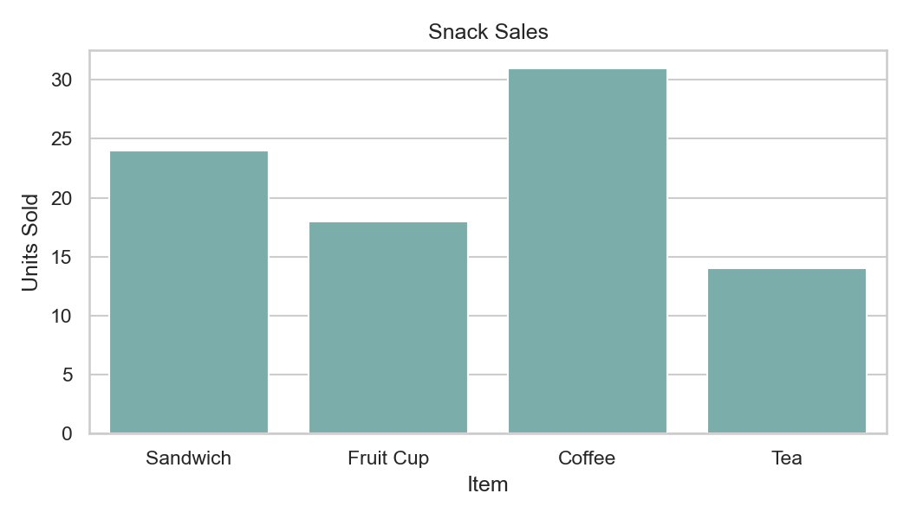
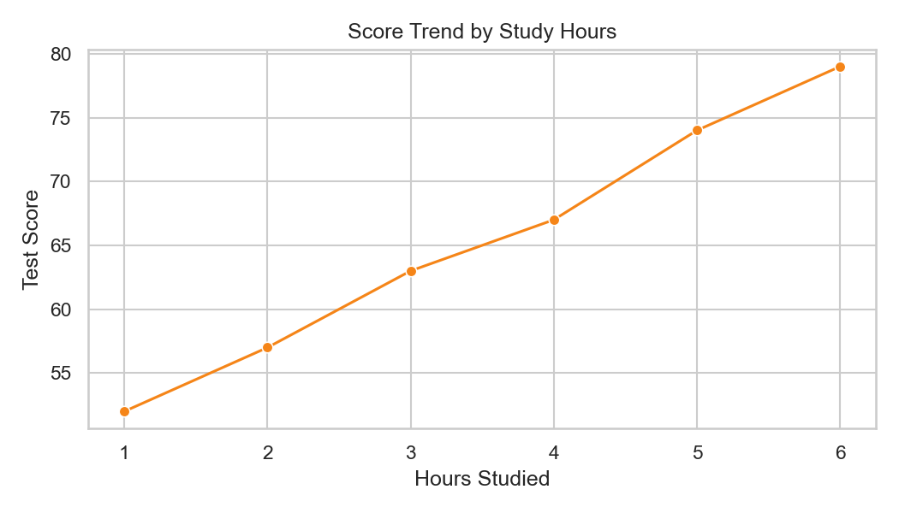
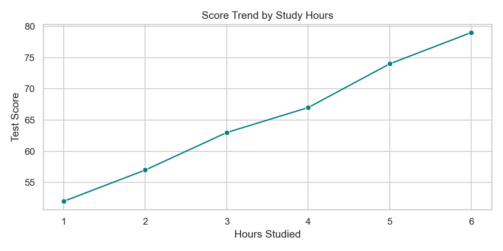

# 02. Worked Examples: Seaborn Basics

## Example A: Create a Small Dataset

Create this structure:

```text
week5-seaborn-demo/
  data/
    student_scores.csv
    snack_sales.csv
  scripts/
    seaborn_scores.py
```

Create `data/student_scores.csv` with this content:

```text
student,hours_studied,test_score
Ana,1,52
Bo,2,57
Lia,3,63
Noa,4,67
Mika,5,74
Sara,6,79
```

Then create `scripts/seaborn_scores.py`:

```python
from pathlib import Path

import matplotlib.pyplot as plt
import pandas as pd
import seaborn as sns

BASE_DIR = Path(__file__).resolve().parent.parent
DATA_DIR = BASE_DIR / "data"

df = pd.read_csv(DATA_DIR / "student_scores.csv")

print(df.head())
print(df.columns)
print(df.dtypes)
```

We use `pathlib` here because the script is in `scripts/`, while the CSV files are in `data/`.

## Example B: Scatter Plot with Seaborn

Add this code:

```python
x_column = "hours_studied"
y_column = "test_score"

fig, ax = plt.subplots()

sns.scatterplot(data=df, x=x_column, y=y_column, ax=ax)
ax.set_title("Study Hours and Test Score")
ax.set_xlabel("Hours Studied")
ax.set_ylabel("Test Score")

plt.show()
plt.close(fig)
```

This is very close to the Matplotlib scatter workflow, but Seaborn lets you work directly with column names from the
DataFrame.

- `x_column` stores the name of the column for the x-axis.
- `y_column` stores the name of the column for the y-axis.
- `ax=ax` tells Seaborn which chart area to draw on.

Reference output:



Your plot does not need to look exactly the same, but you should see the same overall upward pattern.

## Example C: Bar Plot with Categories

Create `data/snack_sales.csv` with this content:

```text
item,units_sold
Sandwich,24
Fruit Cup,18
Coffee,31
Tea,14
```

Then create a Seaborn bar plot:

```python
from pathlib import Path

import matplotlib.pyplot as plt
import pandas as pd
import seaborn as sns

BASE_DIR = Path(__file__).resolve().parent.parent
DATA_DIR = BASE_DIR / "data"

df = pd.read_csv(DATA_DIR / "snack_sales.csv")

x_column = "item"
y_column = "units_sold"

fig, ax = plt.subplots()

sns.barplot(data=df, x=x_column, y=y_column, ax=ax)
ax.set_title("Snack Sales")
ax.set_xlabel("Item")
ax.set_ylabel("Units Sold")

plt.show()
plt.close(fig)
```

Use this when you want to compare the size of separate category values, such as which item sold more or less.

Reference output:



This makes it easy to check which category is highest at a glance.

## Example D: Line Plot with Ordered Data

```python
from pathlib import Path

import matplotlib.pyplot as plt
import pandas as pd
import seaborn as sns

BASE_DIR = Path(__file__).resolve().parent.parent
DATA_DIR = BASE_DIR / "data"

df = pd.read_csv(DATA_DIR / "student_scores.csv")

x_column = "hours_studied"
y_column = "test_score"

fig, ax = plt.subplots()

sns.lineplot(data=df, x=x_column, y=y_column, ax=ax)
ax.set_title("Score Trend by Study Hours")
ax.set_xlabel("Hours Studied")
ax.set_ylabel("Test Score")

plt.show()
plt.close(fig)
```

This is still simple. It helps when the x-axis has a meaningful order.

Reference output:



The line makes the ordered upward trend easier to notice.

## Example E: Add One Small Seaborn Style Improvement

Seaborn is also useful because you can improve the visual style with very little extra code.

```python
x_column = "hours_studied"
y_column = "test_score"

sns.set_theme(style="whitegrid")

fig, ax = plt.subplots(figsize=(8, 4))

sns.lineplot(
    data=df,
    x=x_column,
    y=y_column,
    color="teal",
    marker="o",
    ax=ax,
)
ax.set_title("Score Trend by Study Hours")
ax.set_xlabel("Hours Studied")
ax.set_ylabel("Test Score")

plt.show()
plt.close(fig)
```

- `sns.set_theme(style="whitegrid")` changes the overall chart style.
- `color="teal"` changes the line color.
- `marker="o"` makes each data point more visible.
- `figsize=(8, 4)` changes the figure size through Matplotlib.

Reference output:



This is enough styling for now. The goal is not decoration. The goal is to make the chart easier to read.

## Example F: Simple Interpretation

Practice one short interpretation after each plot:

- The scatter plot suggests that more study hours are linked to higher scores.
- The bar chart shows that coffee sold the most units.
- The line plot shows an upward trend as study hours increase.

## Navigation

- ⬅️ Previous: [01-theory.md](./01-theory.md).
- 🧭 Week Overview: [week-05-overview.md](../week-05-overview.md).
- ➡️ Next: [03-practice.md](./03-practice.md).
