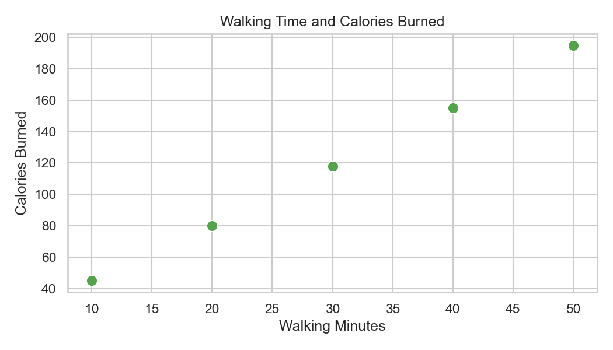
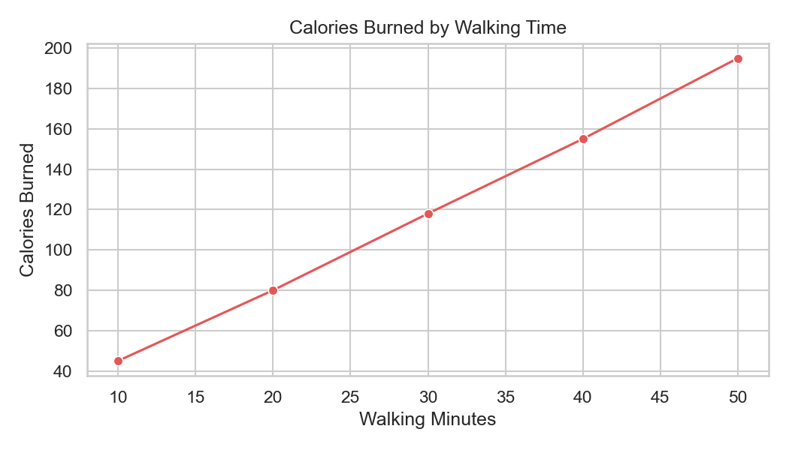

# 03. Practice: Seaborn Basics

## Setup

1. Create a folder called `week5-seaborn-practice`.
2. Inside it, create these folders:
   ```text
   data/
   scripts/
   ```
3. Inside `data/`, create a file called `fitness_data.csv`.
4. Put this exact content in `data/fitness_data.csv`:
    ```text
    person,walk_minutes,calories_burned
    Ana,10,45
    Bo,20,80
    Lia,30,118
    Noa,40,155
    Mika,50,195
    ```
5. Inside `scripts/`, create a script called `plot_fitness.py`.
6. Add this starter code:

```python
from pathlib import Path

import matplotlib.pyplot as plt
import pandas as pd
import seaborn as sns

BASE_DIR = Path(__file__).resolve().parent.parent
DATA_DIR = BASE_DIR / "data"

df = pd.read_csv(DATA_DIR / "fitness_data.csv")

print(df.head())
print(df.columns)
print(df.dtypes)
```

We use `pathlib` here because the script is stored in `scripts/`, but the CSV is stored in `data/`.

## Tasks

1. Run the starter code and confirm the DataFrame loads.
2. Create a Seaborn scatter plot with `walk_minutes` on the x-axis and `calories_burned` on the y-axis.
3. Add the title `Walking Time and Calories Burned`.
4. Add clear axis labels.
5. Show the plot.
6. In the same script, create a Seaborn line plot using the same columns.
7. Add the title `Calories Burned by Walking Time`.
8. Print one sentence that describes the pattern in simple English.

## Expected Output Examples

Possible type output:

```text
person              object
walk_minutes         int64
calories_burned      int64
dtype: object
```

Possible interpretation:

```text
More walking minutes seem to be linked to more calories burned.
```

Your plots should show an upward pattern from left to right.

Reference scatter plot:



Reference line plot:



Use these as a visual check for the chart type, labels, and the main upward pattern.

## Debug Task 1

Code:

```python
import matplotlib.pyplot as plt
import pandas as pd

df = pd.read_csv(DATA_DIR / "fitness_data.csv")
sns.scatterplot(data=df, x="walk_minutes", y="calories_burned")
plt.show()
```

Expected behavior:

```text
You expected a Seaborn scatter plot.
```

Actual behavior:

```text
It raises a NameError because seaborn was never imported as sns.
```

## Debug Task 2

Code:

```python
sns.scatterplot(data=df, x="minutes_walked", y="calories_burned")
plt.show()
```

Expected behavior:

```text
You expected the walking minutes column on the x-axis.
```

Actual behavior:

```text
It raises an error because the real column name is "walk_minutes".
```

## Debug Task 3

Code:

```python
sns.scatterplot(data=df, x="person", y="calories_burned")
plt.show()
```

Expected behavior:

```text
You wanted to study the numeric relationship between walking time and calories burned.
```

Actual behavior:

```text
The plot uses names on the x-axis, so it does not answer the intended question.
```

## Self-Review

- I can use Seaborn with a Pandas DataFrame.
- I can explain what `data=`, `x=`, and `y=` mean.
- I can choose a simple Seaborn chart and label it clearly.
- I can debug missing imports, wrong columns, and wrong axis choices.

## Navigation

- ⬅️ Previous: [02-worked-examples.md](./02-worked-examples.md).
- 🧭 Week Overview: [week-05-overview.md](../week-05-overview.md).
- ➡️ Next: [04-challenge.md](./04-challenge.md).
